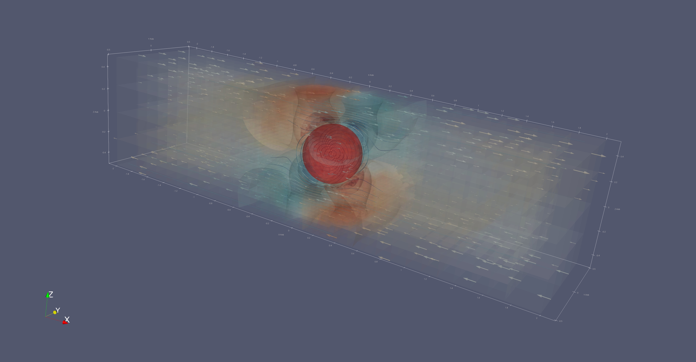

# FELSPA

**Finite Element library for Level Set and Particle Algorithms** (FELSPA) is a finite element numerical library designed for modelling geological flow in viscous flow regimes. 

## Installation

## Examples

